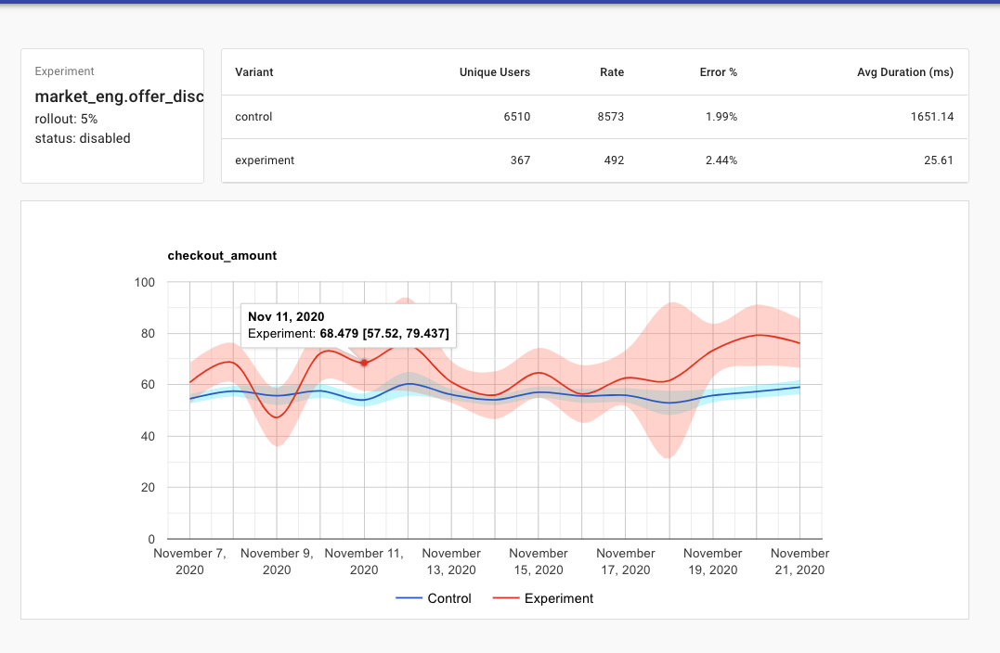

# scrutinize

scrutinize is a lightweight experimentation framework focused on conducting and analysing online experiments (a/b tests).

# Motiviation

Currently the ecosystem for A/B testing tools consists of either costly SaaS providers, or incomplete open source solutions. For smaller companies that cannot afford an enterprise offering, options are limited to discontinued projects, fragmented deployments or building a platform in house.

scrutinize aims to be an all in one package for designing, conducting, monitoring and analysing controlled online experiments at reasonable scale. It is a server + suite of clients that works well with the currently popular microservice ecosystem.

# Getting Started

Consult the [Quickstart Guide](docs/quickstart/QUICKSTART.md) for instructions on deploying the scrutinize service and conducting an experiment via the client.

# Contributing

Feel free to open an issue, PR or simply have a discussion about modifications to this project. In the weeks to come we'll try to flesh out a more comprehensive set of contribution guidelines.

# Inspiration

Scrutinize was inspired by and draws elements from the following projects:

 - [Unleash](https://github.com/Unleash/unleash) _system & client design_
 - [Uber XP](https://eng.uber.com/xp/) _analysis system_
 - [Wasabi](https://github.com/intuit/wasabi) _api design_

The following book informed a lot of the design choices in this project:

[Trustworth Online Controlled Experiments: A Practical Guide to A/B Testing](https://books.google.com/books/about/Trustworthy_Online_Controlled_Experiment.html?id=bJY1yAEACAAJ)

# Roadmap

Some next high level goals for this project are as follows:

 - Calculating p-values on the evaluation metrics to better inform experiment success
 - Bulk upload of observation metrics via api
 - Client consistency with respect to experiment toggles (active killswitch)
 - Automated power estimation and recommendation via 1-7 day A/A dry run
 - Caching performance results to ensure scalibility in analysis
 - Population selection for experiment iterations

# Credits

Special thanks go out to Lisa Jiang and Punya Biswal for their feedback on both system and api design on this project.
