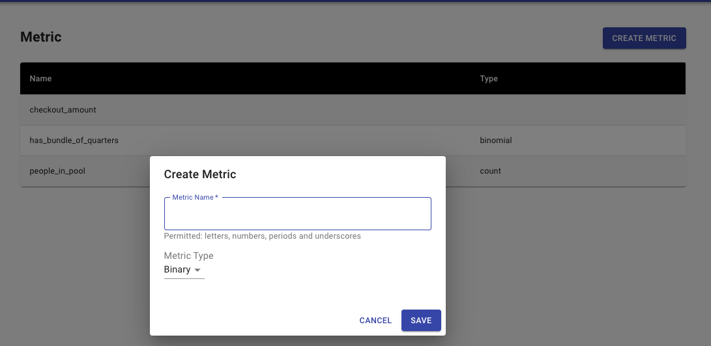

# Quickstart

The quickstart guide is structured so that you can quickly and easily understand the scrutinize feature set in an easy enough way. This guide will walk you through the following:

1. Running the service
2. Installing the client
3. Adding metrics to your project
4. Setting up your first experiment
5. Reviewing the results of your experiment

### Requirements

| Requirement   | Version       |
| ------------- | ------------- |
| docker-compose| 1.0+          |
| python        | 3.6+          |

### Running the service

After cloning the repository locally, you can start the server and database using docker compose:

```bash
cd <path>/<to>/<scrutinize>
docker-compose up
```

scrutinize should then be running on port 5001, verify this by navigating to the [Experiments Dashboard](http://localhost:5001).

### Installing the client

Now that the server is populated you are ready to begin using the client. Install a client of your choice (currently only python) into the project you want to experiment with.

```bash
pip install scrutinize
```

### Adding a metric to your project

Before you can use the client, you need to add some metrics and experiments. Experiments depend on metrics, so please create some metrics first by navigating to the [Metrics Dashboard](http://localhost:5001/metrics). Some example metrics might include "converted", "purchase_price", "load_time_ms" and "user_click".



Once you've completed that, you can start recording metrics from within your application using the client. See the below code snippet for an example:

```python
from scrutinize import ScrutinizeClient

class CheckoutController:
    def __init__(self, scrutinize: ScrutinizeClient, ...):
        self.scrutinize = scrutinize
    ...

    def complete_purchase(self, user_id):
        basket = self.get_basket(user_id)

        # recording a metric value for reporting
        self.scrutinize.observe(
            user_id,
            'checkout_amount',
            basket.price_total,
        )
```

### Setting up your first experiment

Navigate to the [Experiments Dashboard](http://localhost:5001) and create an experiment with some of the metrics just added.


When the experiement has been saved, turn on the __Active__ toggle to ensure that traffic to the experiment can see the new behavior.

You should be able to now conduct the experiment in your service using the client API. Use the below code snippet as a reference:

```python
from scrutinize import ScrutinizeClient

class AdsController:
    def __init__(self, scrutinize: ScrutinizeClient, ...):
        self.scrutinize = scrutinize
    ...

    def show_ads(self, user_id):
        return self.scrutinize.call(
            'ml_eng.new_ads_model',
            user_id,
            lambda: self.ads_model.predict(user_id), # control behavior
            lambda: self.new_ads_model.predict(user_id), # experiment behavior
        )
```

### Reviewing the results of your experiment


While your experiment is running, you can use the Performance feature in the [Experiments Dashboard](http://localhost:5001) to get RED metrics on your experiment, as well as the selected Evaluation Metrics you had defined.


